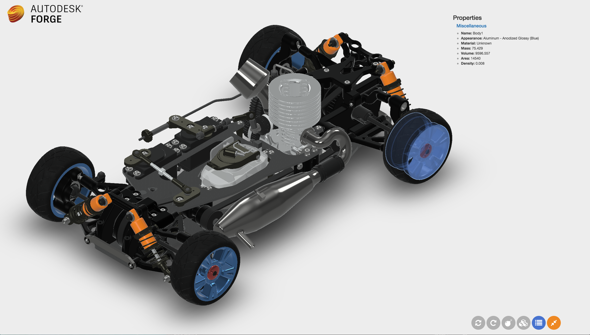

# Viewer - React - Express - Headless

 

## Description

Using Forge Viewer, you have the option of a Headless one, the option to add your own logo and get rid of extension that interact with the viewer is possible. 
I created a demonstration of this scenario using React on the Front End, Redux to handle states for Properties metadata access and NodeJS (Express) together with React-Scripts to handle the authentication and access to the use of the Forge services. 

The available Extensions once in Full Screen mode are.
- Properties (Categories are display with the option to expand to see all metadata available from the model)
- Explode Slider
- Explode Animation
- Rotate Animation
- Restate of the model to original form

This sample show a simple integration of the [Viewer](https://developer.autodesk.com/en/docs/viewer/v2/overview/) in a headless way with custom made extensions. The front-end will look like:

### Thumbnail

 

## Setup

The 6 models will need to translated and hosted on your own bucket. This will change the URN values that will need to be subtitued here. 
[URN Gallery JSON](https://github.com/Autodesk-Forge/viewer-react-express-headless/blob/master/src/components/Gallery/Gallery.js#L29)

Feel free to use your own models in the Gallery. 

### Note Restore State

The Restore State functionality is hardcoded for the specific models. You will need to get the State for each of your models and pass the new JSON value at this location 
[Restore State JSON](https://github.com/Autodesk-Forge/viewer-react-express-headless/blob/master/src/components/Viewer/Viewer-helpers.js#L156) 

### Development mode

Follow these instructions to get the app running locally:

1. run `git clone` this repository
1. `cd` into the project's directory
1. create a file called `server/credentials.js` with your credentials, [follow this template](https://github.com/Autodesk-Forge/viewer-react-express-headless/blob/master/server/credentials_.js)
1. run `npm install`
1. run `npm run watch`

This will get a server running locally, open `http://localhost:3000` on your browser to see the app running.

### Production mode

To run this app in production mode, run `npm run build` and then `npm start` in a production environment.

If you try to deploy this on Heroku, we set a `postinstall` script that will run the `build` script, so there is no need to run it again, simply let Heroku run `npm start` (which it does automatically) and you'll be good to go.

## Heroku Deployment

To deploy this project to Heroku, be sure to set your environment variables in the dashboard:

- `FORGE_CLIENT_ID`
- `FORGE_CLIENT_SECRET`

--------

## License

This sample is licensed under the terms of the [MIT License](http://opensource.org/licenses/MIT).
Please see the [LICENSE](LICENSE) file for full details.

## Written by

Jaime Rosales D.   
  Forge Partner Development  
<a href="http://developer.autodesk.com/">Forge Developer Portal</a>  

